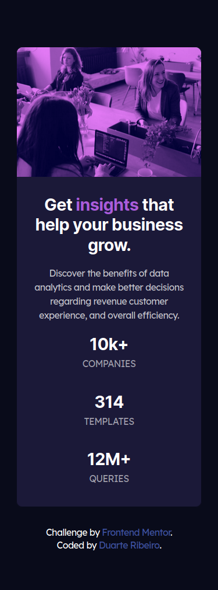
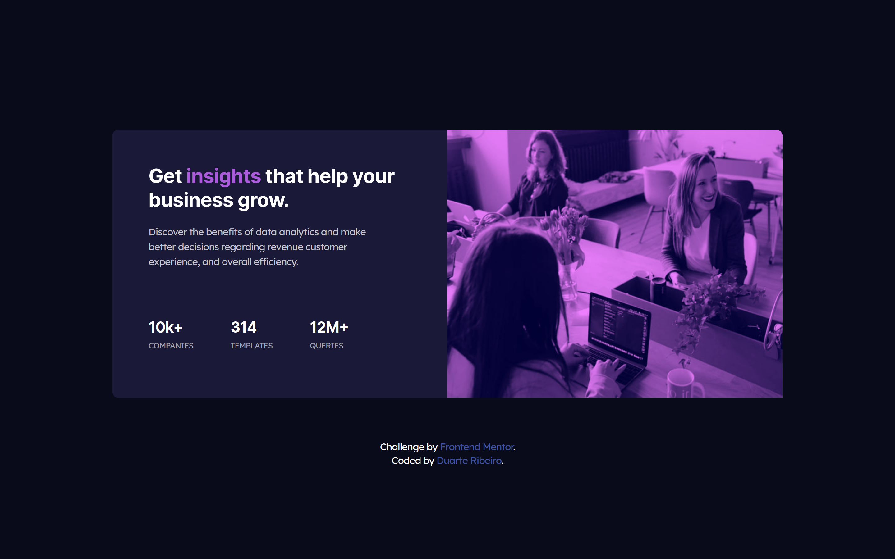

# Frontend Mentor - Stats preview card component solution

This is a solution to the [Stats preview card component challenge on Frontend Mentor](https://www.frontendmentor.io/challenges/stats-preview-card-component-8JqbgoU62). Frontend Mentor challenges help you improve your coding skills by building realistic projects.

## Table of contents

- [Overview](#overview)
  - [The challenge](#the-challenge)
  - [Screenshot](#screenshot)
  - [Links](#links)
- [My process](#my-process)
  - [Built with](#built-with)
  - [What I learned](#what-i-learned)
  - [Continued development](#continued-development)
  - [Useful resources](#useful-resources)
- [Author](#author)

## Overview

### The challenge

Users should be able to:

- View the optimal layout depending on their device's screen size

### Screenshot




### Links

- Solution URL: [Add solution URL here](https://github.com/duartrosar/stats-preview-card-component)
- Live Site URL: [Add live site URL here](https://epic-jones-285c87.netlify.app/)

## My process

### Built with

- Semantic HTML5 markup
- Flexbox
- Mobile-first workflow
- [Sass](https://sass-lang.com/) - Node Sass
- [React](https://reactjs.org/) - JS library
- [Next.js](https://nextjs.org/) - React framework

### What I learned

This was my first <mobile-first> and "fully" responsive project. I tried not to use absolute units and not to repeat code. I also tried to divide my project into as many smaller sections as possible, it was little bit confusing at first navigating the project folders, but thanks to Sass and VSCode, I quickly got used to it. I struggled specially with sizing the image and "making it grow" with the layout, I'm still not very happy with how I achieved it.

The only thing I'm really proud of is not using the <height> property, as this is something I've struggled with before, and, as I've mentioned before not using absolute units to size components.

The following is something I'm NOT proud of. I could not figure out how to format the text like in the brief prictures, in order for it to have the same amount of lines.

```html
<div class="body">
  <!-- I could not find a way to get the same text formatting as the image without line breaks -->
  <p class="p-main">
    Discover the benefits of data<br />
    analytics and make better decisions<br />
    regarding revenue customer<br />
    experience, and overall efficiency.
  </p>
  <!-- I'm sorry...-->
  <p class="p-main-large">
    Discover the benefits of data analytics and make <br />better decisions
    regarding revenue customer<br />
    experience, and overall efficiency.
  </p>
</div>
```

```scss
.p {
  &-main {
    color: $secondary-white;
    line-height: 1.5;
    // I really don't like this solution to obtain the right text formatting
    // See mark up*
    &-large {
      display: none;
      color: $secondary-white;
      line-height: 1.5;
      // "Swap" the paragraphs depending on screen size
      @include mq("huge") {
        display: block;
      }
    }
    @include mq("huge") {
      display: none;
    }
  }
  &-stats {
    color: $tertiary-white;
    text-transform: uppercase;
    margin-top: 8px;
  }
}
```

### Continued development

Use this section to outline areas that you want to continue focusing on in future projects. These could be concepts you're still not completely comfortable with or techniques you found useful that you want to refine and perfect.

### Useful resources

- Kevin Powell's [Youtube](https://www.youtube.com/user/KepowOb) and Conquering Responsive Layouts[Course](https://courses.kevinpowell.co/conquering-responsive-layouts)- Pretty much any video Kevin has on responsive layouts and sass, I love it! In this project (after watching some of his videos) I tried not to use the <height> property and also not use absolute units for the <width> of components.
- I absolutely love these [Sass Guidelines](https://sass-guidelin.es/) written by [Kitty Giraudel](https://kittygiraudel.com/), specially the section on [Architecture](https://sass-guidelin.es/#architecture). It inspired me to be more organized with my projects and create good habits.

## Author

- Github - [Add your name here](https://github.com/duartrosar)
- Frontend Mentor - [@duartrosar](https://www.frontendmentor.io/profile/duartrosar)
